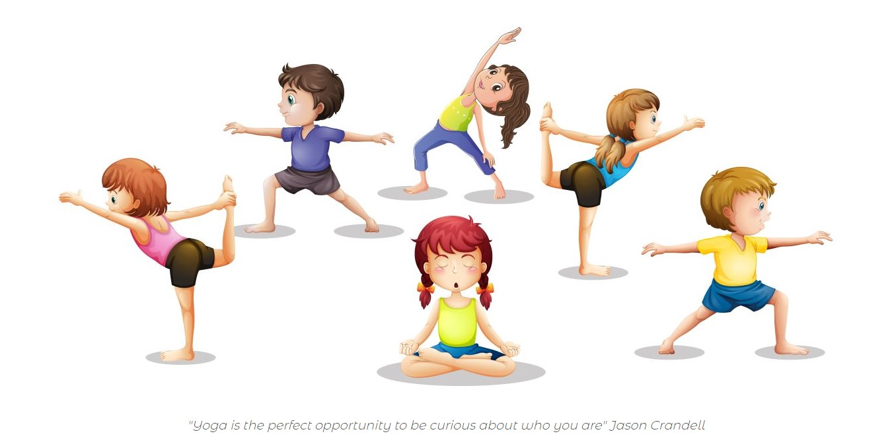
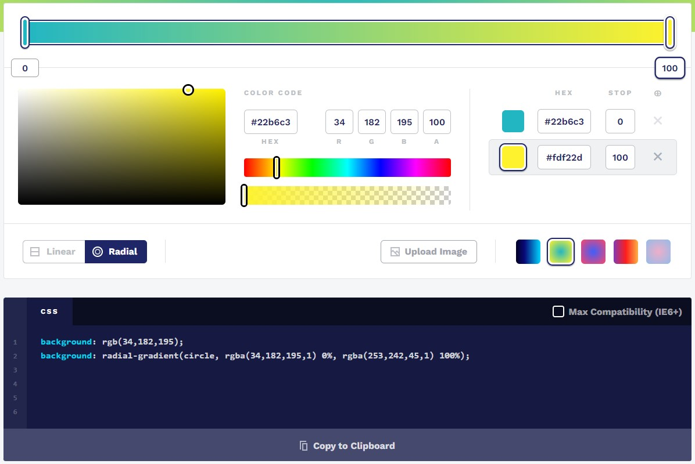
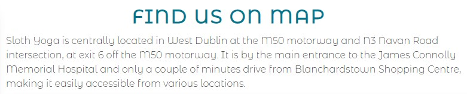
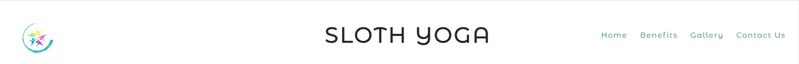
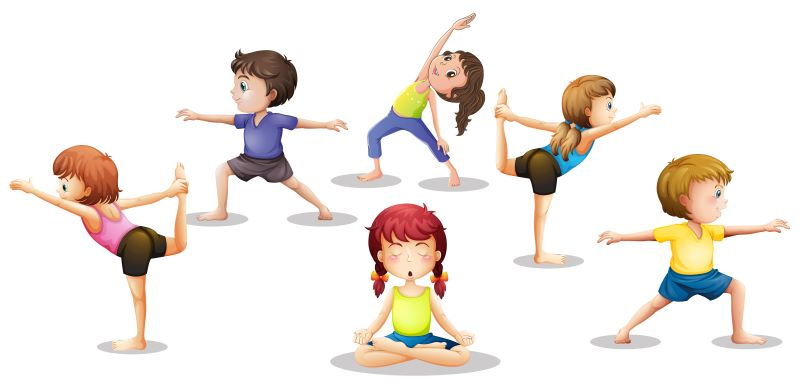
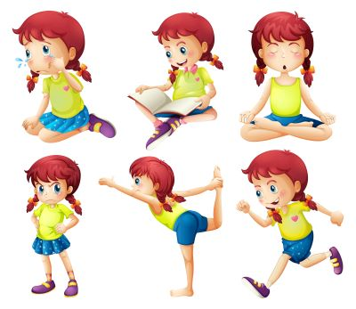
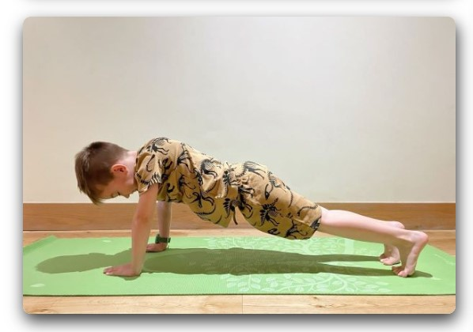

# **Sloth Yoga**

## **Overview**

Sloth Yoga is a site for kids yoga studio based in Dublin, Ireland. Based in Castleknock, Dublin we are never too far away. The idea about yoga studio for kids was born after our son was struggling to regulate his emotions, therefore getting upset and angry very often. With my yoga and an exercise knowledge, we started a fun and exiting journey of helping many more. We are passionate about yoga and benefits it gives to not only adults but children alike. The goal of website is to draw interest to Sloth Yoga studio, while highlighting benefits of becoming a yogi. Yoga is for everyone but promoting healthy habits and self care to kids at early age through yoga practise builds basis of healthier lifestyle.

## **Planning**

### **Intended Users**

* Parents interested in yoga for their kids.
* Kids looking to have fun while improving their physical and mental abilities.
* Primary school teachers looking for yoga benefits to incorporate practise in classes.
* Anyone with over interest in kids yoga.

### **User Stories**

* As a user, I want to know the main intention of the site.
* As a user, I want to be able to easily navigate through the site.
* As a user, I want to see if I can trust an organization.
* As a user, I want to be able to connect through social media and/or email, phone.
* As a user, I want to find location of studio easily.

### **Site goals**

* To reach out to clients for yoga studio.
* To educate kids, parents and people in general about benefits of kids yoga.
* To give people way to contact yoga studio and find location easily.

### **Wireframes**

For this project I made desktop and mobile wireframes to help with site planning and design. While I made a few changes as I went along, please find original wireframes bellow:
* Desktop wireframes:
  * [Home Page](assets/wireframes/home_page_sloth_yoga.png)
  * [Benefits Page](assets/wireframes/benefits_page_sloth_yoga.png)
  * [Gallery Page](assets/wireframes/classes_page_sloth_yoga.png)
  * [Contact Us Page](assets/wireframes/contact_us_sloth_yoga.png)
* Mobile wireframes:
  * [Home Page](assets/wireframes/mobile_home_sloth_yoga.png)
  * [Benefits Page](assets/wireframes/mobile_benefits_sloth_yoga.png)
  * [Gallery Page](assets/wireframes/mobile_classes_sloth_yoga.png)
  * [Contact Us Page](assets/wireframes/mobile_contact_us_sloth_yoga.png)

### **Color Scheme**

For color scheme I chose blue and yellow tones but kept them to a minimum to keep website light and showcase info and images. Blue color is known for friendly, inviting and calming emotions, yellow is associated with joy and friendliness. Apart of choosing color shades myself, I used cssgradient.io for footer and picked shades out of it for logo image.

### **Fonts**

After checking Great vibes font for headers I noticed it gives too elegant look and doesn't suit the style so I changed header font to Montserrat Alternates Regular as it feels more fitting for the site and kept Montserrat Alternates Light for content for clean look and easy readability. I decided to choose charcoal color for font after learning during Love Running project that it is easier to read for people with poor eyesight.

## **Features**

As I am big believer of living simplier, lighter and not as cluttered life I wanted to make a website that's minimalistic in style.

### **Header**

Shown identical on all pages with logo image, title and navigation bar with links to Home, Benefits, Gallery and Contact Us page.

### **Logo**

I had a hard time choosing the right logo as I didn't want to pay and as someone with Diploma in Interior Design, I naturally wanted to make one myself. After few unsuccessful attempts, I created one in Canva using an example they had and adjusted colors to suit my website. Colors are taken from hero image and footer.

### **Hero image**

For hero image I chose a vector that is not too heavy and had minimalistic style with children practising yoga. It has colors I used as well. I went through a lot of research while looking for images and settled on neat looking vectors, apart of Gallery Page.

### **Home Page**

Home Page features hero image with a short quote under it and a short introduction about us as a Sloth Yoga studio and why it was our decision to open one to give users some story behind it.
#### *Quote:* "Yoga is the perfect opportunity to be curious about who you are" Jason Crandell

### **Benefits Page**

This page describes benefits with explanation of yoga practise for kids (and adults as well if we are being honest). I added hover-over feature that slightly enlarges text to help during reading. Gallery Page has one vector image so to give page some color and after some research found a perfect image showing girl in different emotions.

### **Gallery Page**

For gallery I chose fun, colorful photos to give site joyful feel and added a short paragraph. Part of photos are downloaded from pexels.com, the other part I took myself of my 5 year old son Dean who loves yoga and is the reason why I chose to make this website. I added a slight shadow to photos to give a depth to page and a hover-over feature to slightly enlarge photo.

### **Contact Us Page**

This page allows user to contact studio through form to book a yoga class or ask any additional questions that may arise, find opening times and location of Sloth Yoga studio on map.

### **Thank You Page**

Thank You Page features a thank you message and an image after form has been filled out and submitted.
.

## **Deployment**

The website was deployed to GitHub pages:

1. From this project's [link for repository](https://github.com/violaberg/sloth-yoga-p1), go to the **Settings**.
2. From the left-hand menu, click on the **Pages**.
3. Under the **Source** section, select the **Main** branch from the drop-down menu and click **Save**.
4. A message will appear to confirm a successful deployment to GitHub pages and provide the live link.

Live link to the website - [Sloth Yoga](https://violaberg.github.io/sloth-yoga-p1/)

## **Credits**

* The biggest thank you to my family, especially our 5 year old son who was left to his own devices for way too long while I was sitting at pc for hours and full days at the end of this project.
* Thank you as well to my mentor David Bowers (I promise to book in on time for next project) who encouraged me to get started.
* And thank you to Kim for support and who did her project for this course just as late at night as I did.

### **Content**

Content was written by myself with some helpful websites for Benefits Page that are included in Media section.

### **Media**

* Photos for Gallery Page from [Pexels website](https://www.pexels.com/): 
  * [Photo by Laysla Loyse](https://www.pexels.com/photo/girl-standing-in-raja-bhujangasana-pose-at-home-4256377/)
  * [Photo by Yan Krukau](https://www.pexels.com/photo/active-children-doing-balancing-exercises-8613312/)
  * [Photo by Lena Helfinger](https://www.pexels.com/photo/girl-in-white-shirt-and-black-pants-lying-on-blue-exercise-ball-3992594/)
  * [Photo by Yan Krukau](https://www.pexels.com/photo/children-in-yoga-position-learning-to-concentrate-8613321/)
  * [Photo by Artem Podrez](https://www.pexels.com/photo/a-woman-in-white-sleeveless-blouse-6951780/)
  * [Photo by Lena Helfinger](https://www.pexels.com/photo/girl-in-blue-tank-top-and-black-pants-splitting-on-blue-yoga-mat-3992601/)
  * The rest of the photos in Gallery Page were taken by myself.

* Hero, Benefits and Thank You image were sourced from [Vecteezy website](https://www.vecteezy.com/):
  * [Hero image](https://www.vecteezy.com/vector-art/360920-children-stretching)
  * [Benefits Page image](https://www.vecteezy.com/vector-art/682922-a-young-lady-doing-different-activities)
  * [Thank You Page image](https://www.vecteezy.com/vector-art/12723555-group-of-people-practicing-yoga)

* Footer gradient - [CSS Gradient website](https://cssgradient.io/)
* Benefits content ideas :
  * [Lingokids website](https://lingokids.com/blog/posts/top-10-benefits-of-yoga-for-kids)
  * [Healthy Children website](https://www.healthychildren.org/English/healthy-living/emotional-wellness/Pages/Permission-to-Unplug-The-Health-Benefits-of-Yoga-for-Kids.aspx)

* All icons are from [Font Awesome](https://fontawesome.com/)

## **Future development**

In future, there may be links added to yoga blog for deeper understanding of kids yoga and added option for an online booking. And hopefully Sloth Yoga will become a real studio for kids to come and practise yoga. Namaste yogi!
