# Testing Page

## **Testing during development**

* Manually tested each element for appearance and responsiveness with Dev Tools.
* Asked friends and family to use website.
* During testing I checked few browsers to ensure compatibility:
  * ***Mozilla Firefox*** - GOOD
  * ***Microsoft Edge*** - GOOD
  * ***Chrome*** - GOOD
  * ***Safari*** - Didn't test as I don't have IOS

### **Bugs and fixes**

* **Wanted Outcome** - A header with 3 evenly spaced out items in the header.
  * ***Issue Found and solution used*** - Items wouldn't align evenly either horizontally or vertically. After many different codes, a fellow student suggested flexbox. Worked perfectly!
  
* **Wanted Outcome** - Evenly aligned photos in gallery.
  * ***Issue Found and solution used*** - Unfortunately nothing helped most of times as Code Anywhere kept going offline so I took a break, while it was nice, I didn't have spare time as I was behind. Solution - will use VSCode for the next project. For the time when it did finally work, class .image-grid img:nth() was a great way tp position photos around the way I wanted.
  
  * **Wanted Outcome** - Give some color to website.
  * ***Issue Found and solution used*** - Anything I tried seemed to heavy, colorful or dark for my website. I tried to make it more opaque but still every color was either too dark or too bright. A quick search in [Google](https://www.google.ie/) revealed how can I make gradient background. After trying I still wasn't delighted with outcome and decided to use those gradient colors just for the footer.
  
* **Wanted Outcome** - Embeded [Google](https://www.google.ie/) map for Contact Us Page.
  * ***Issue Found and solution used*** - Did some research on Google and found instructions on their website.
  
* **Wanted Outcome** - Align contact us form and map beside each other.
  * ***Issue Found and solution used*** - I simply didn't know how to do it. After some research I found flexbox working great.
  
* **Wanted Outcome** - The same header on all pages.
  * ***Issue Found and solution used*** - Couldn't style header on Thank You Pages. It wasn't responding to code so I made a separate class .thank-you-header.
  
* **Wanted Outcome** - Legend for reasons radio buttons.
  * ***Issue Found and solution used*** - Couldn't use legend as a child as per validator. Changed to h2:
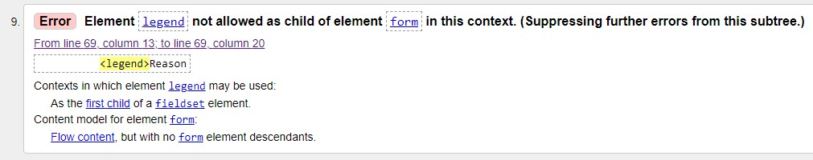

* **Wanted Outcome** - Navigation bar.
  * ***Issue Found and solution used*** - I didn't close .div tag as per validator. Checked the code and closed it:
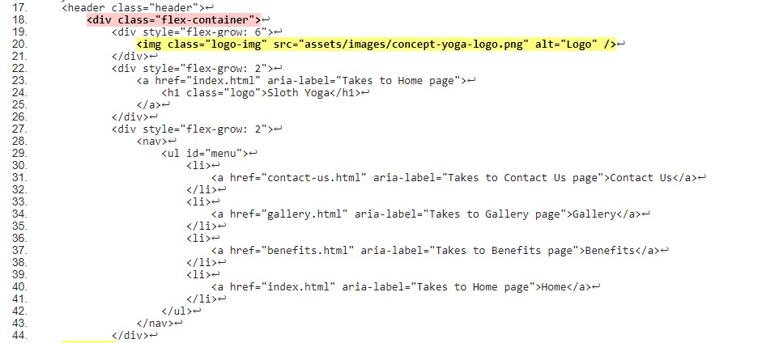

## **Testing after development**

### **Validator Testing**

I was delighted to have just 2 identical errors in validator that were very quick to fix. I used align-items: left, where I should have used text-align: left.

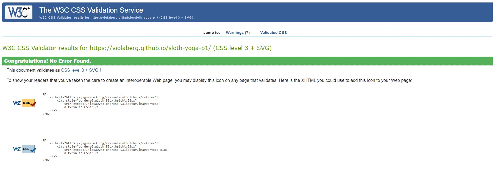

### **Lighthouse**

I was delighted with results. Performace was slightly lower on pages with images but my network sometimes can be very slow too so I wasn't surprised. I took some screenshots as results were close all the time. Here are screenshots from each page for desktop and mobile screens:

* Home page:

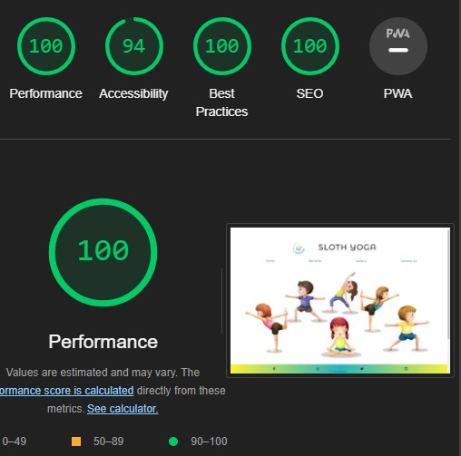

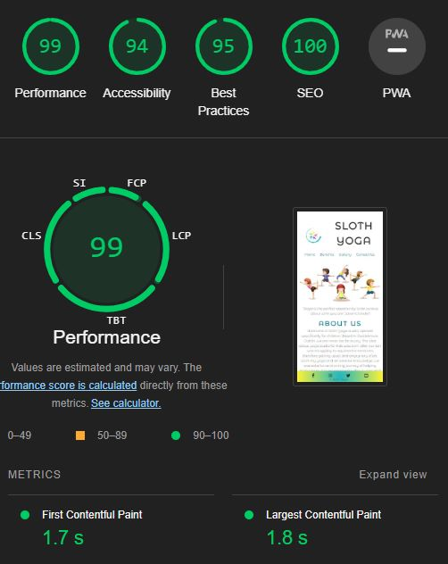

* Benefits Page:

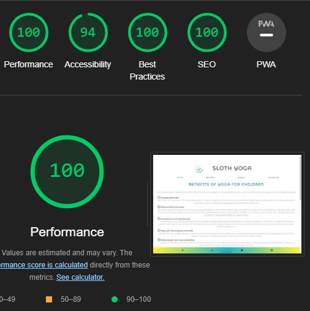

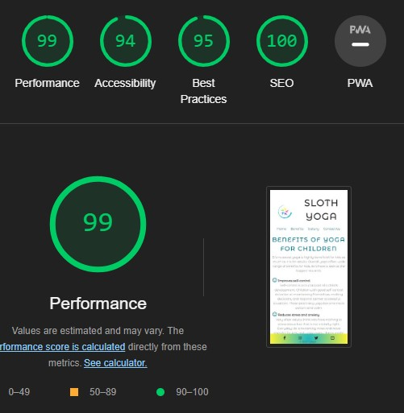

* Gallery Page:

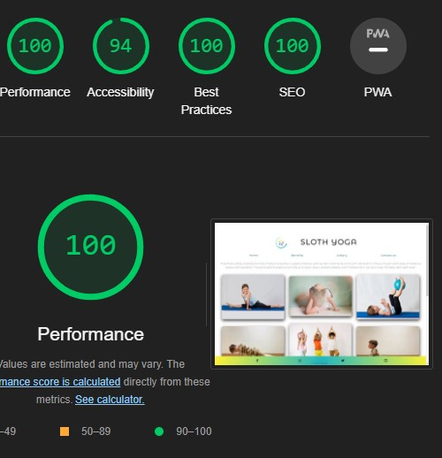

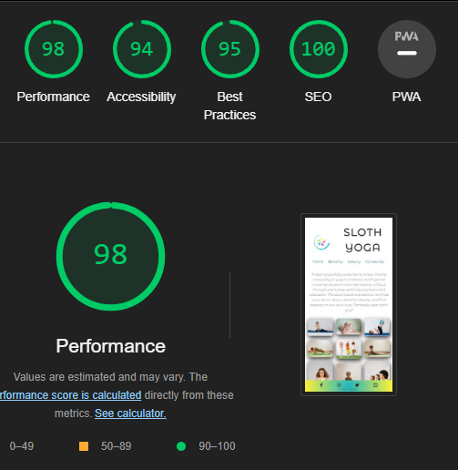

* Contact Us Page:

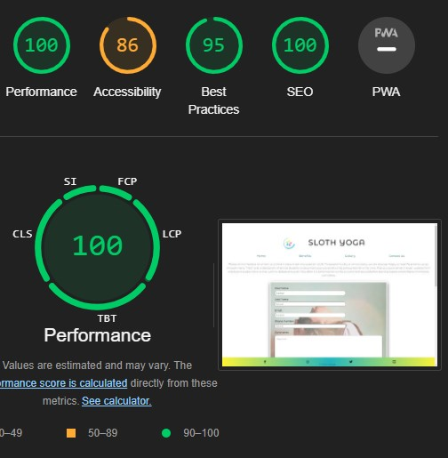

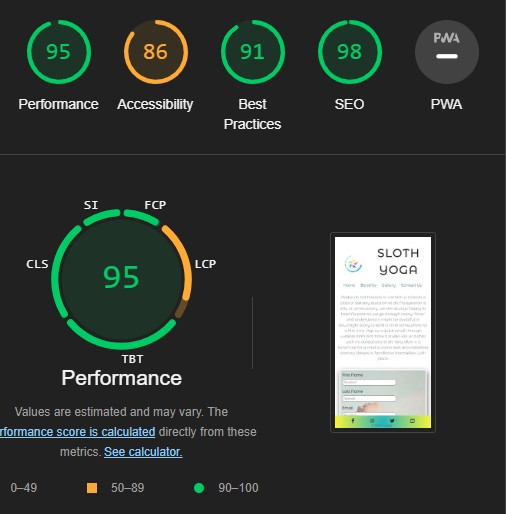

* Thank You Page:

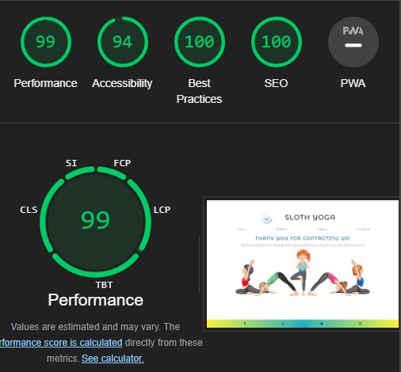

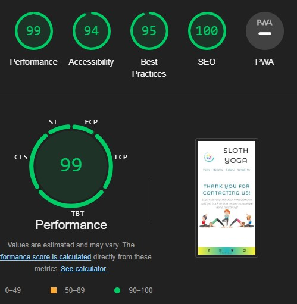

### **Am I Responsive**

I used [Am I Responsive](https://amiresponsive.co.uk/) website as well. Here is the outcome:

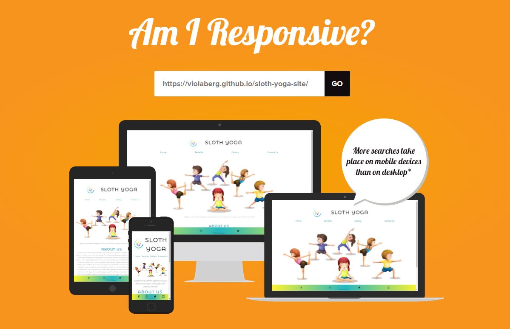

### **DevTools**

I used DevTools and a lot of screenhots were taken, all available in [media-screen-img](assets/media-screen-img/) folder. I will add few below as an example:

* Home Page for media max-width: 480px:

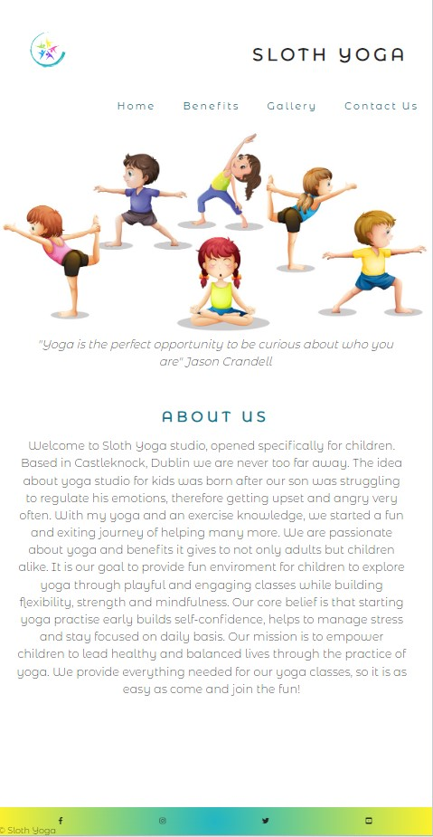

* Benefits Page for media max-width: 767px:

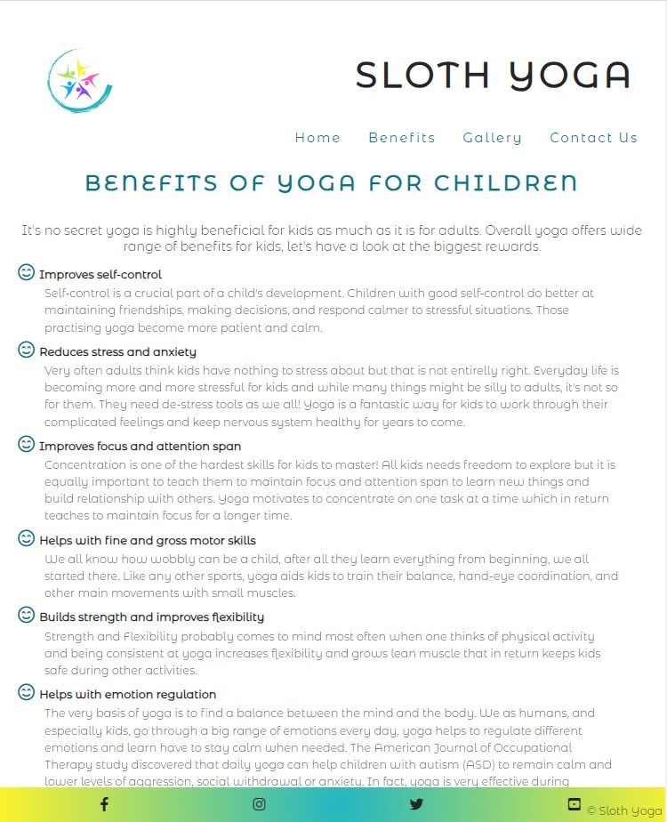

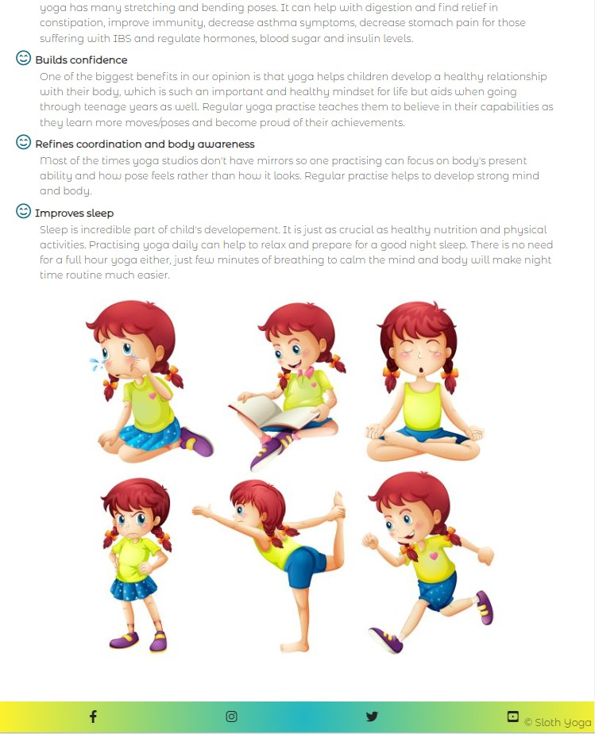
  
* Gallery Page for media max-width: 1024px:

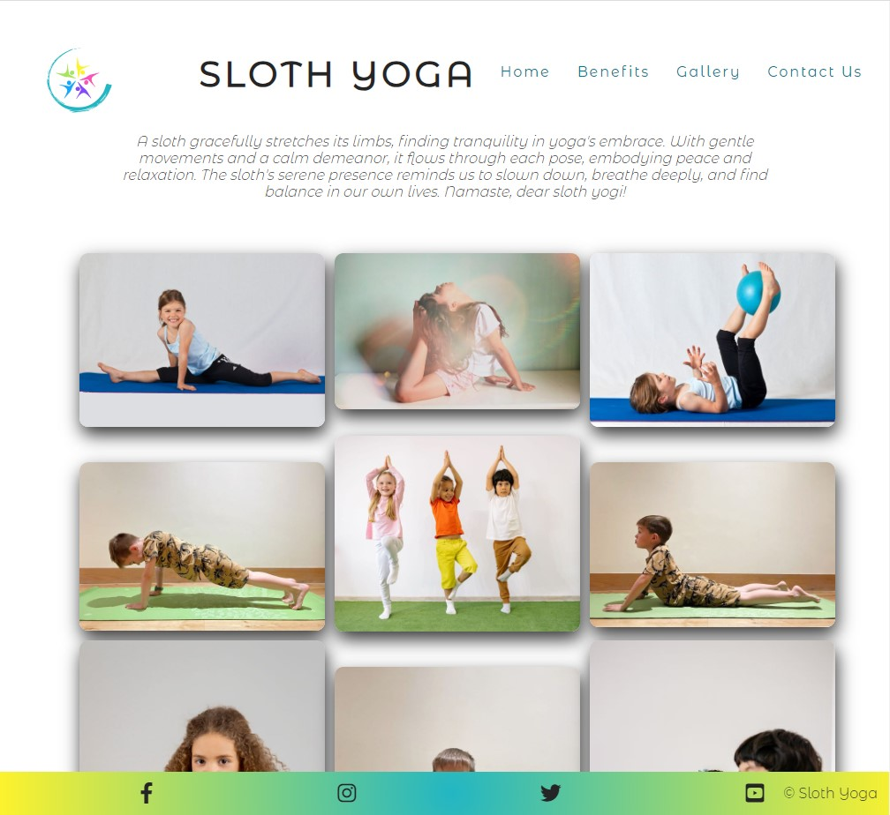

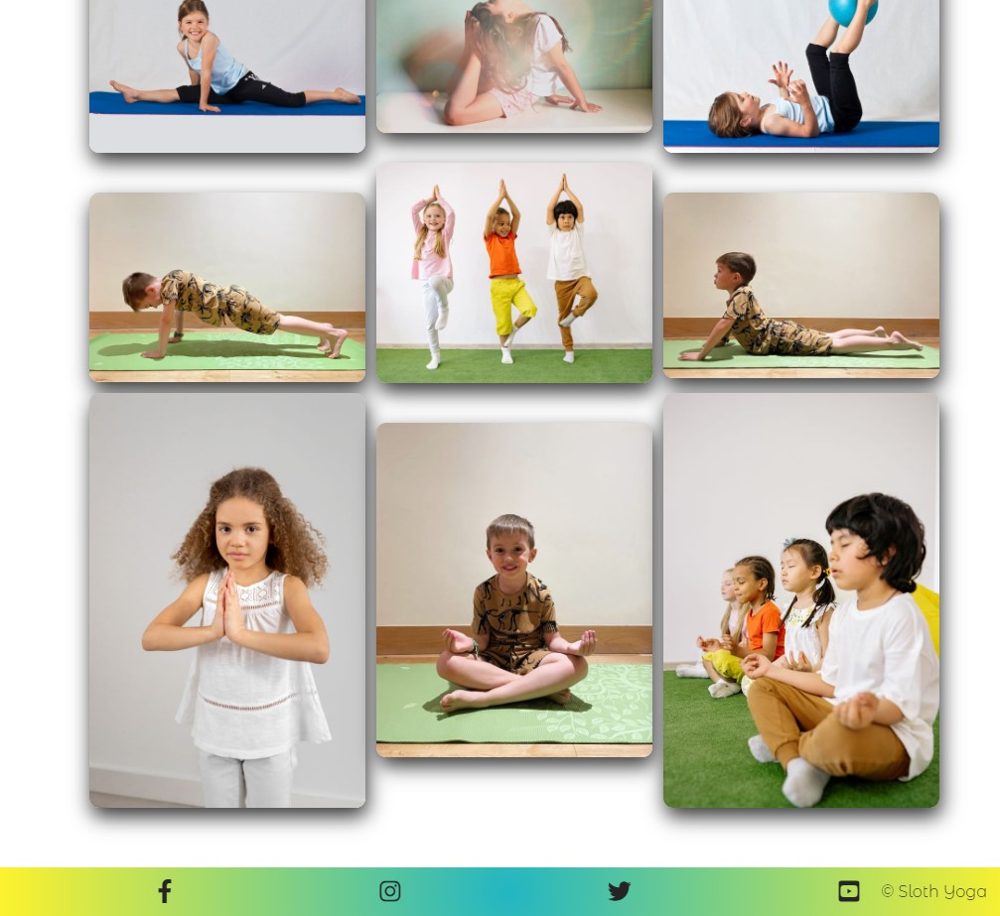
  
* Contact Us Page for media max-width: 1800px:

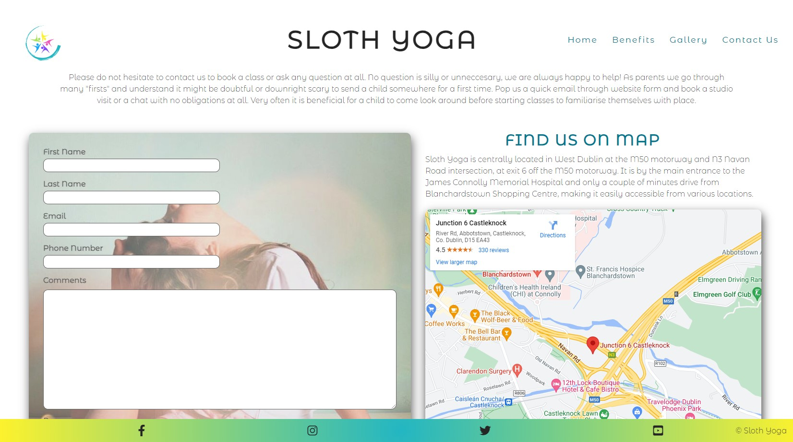

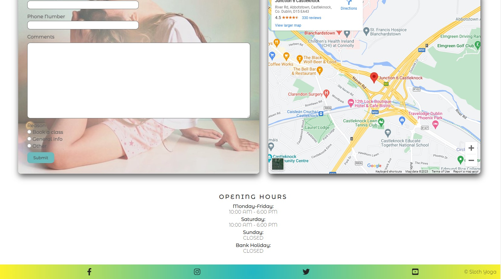
  
* Thank You Page for media max-width: 1200px:
  
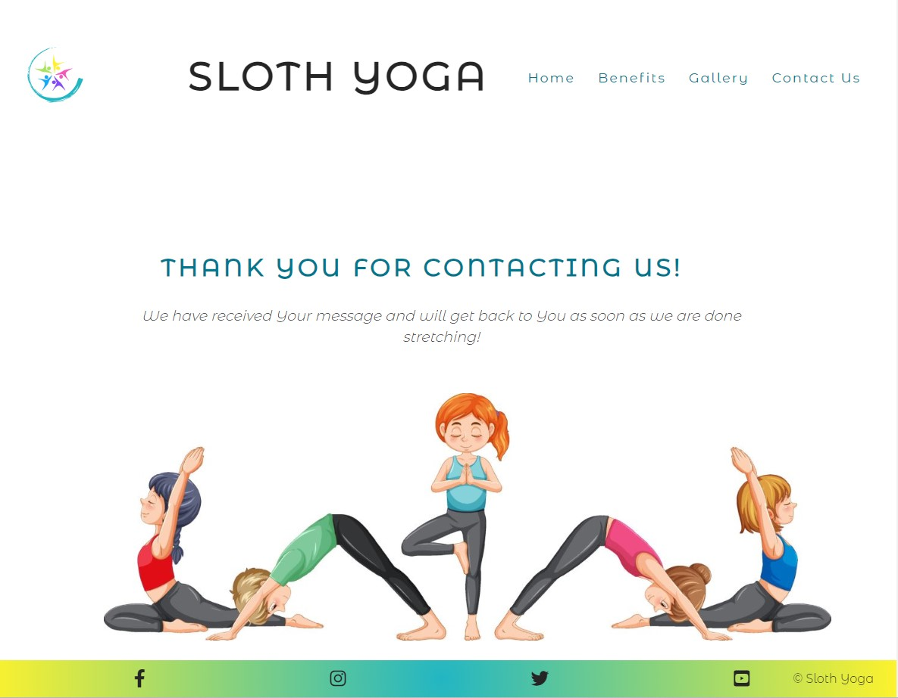
